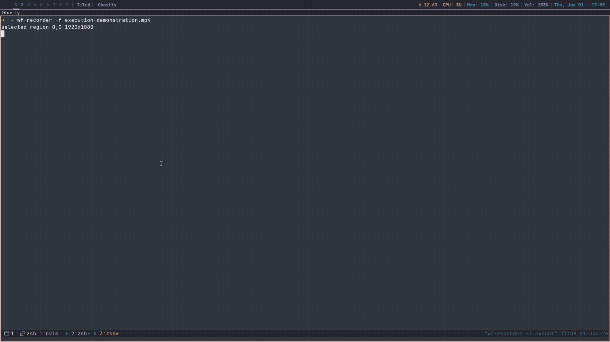

### sshGui

sshGui is a simple applications that lists defined servers and allows the user to select a server to join. These servers, along with the terminal to launch them in, and their names
displayed in the list are all defined in the config file. To run this application simply ensure that the runner script is executable and then run ./runner. The multiple dotool commands
within the runner script is due to the fact that I use the Sway window manager and like the program to float once it is opened, this code will not affect the execution of the program
if you do not use Sway. The commands at the top of the runner file also ensure compatiblity with other linux distributions so the program displays correctly. To run this program the
latest version of the JDK is required (default-jdk or equivilant). At the moment there is no windows support as the ssh command works differently to how it does on linux, however this
may be implemented in the future. This code may or may not work on Mac systems, I do not know as I have no way to test this.

